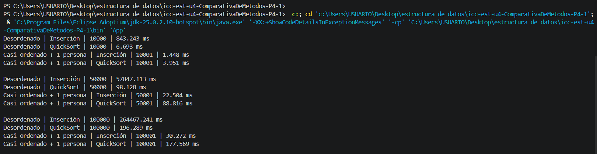

# Práctica de Ordenamiento de Personas
## Santiago Satama

## Descripción

Se implementó una aplicación en Java cuyo propósito es crear arreglos de objetos de tipo Persona y evaluar su ordenamiento utilizando dos métodos diferentes: Insertion Sort y QuickSort.

Cada objeto Persona almacena información como el nombre y la edad. Para realizar el ordenamiento, se toma como criterio principal la edad de la persona. En los casos donde dos personas poseen la misma edad, se utiliza un valor numérico derivado del nombre para determinar el orden correspondiente.

### Escenario 1: arreglo completamente desordenado

En este escenario se generó un conjunto de personas con edades asignadas de forma aleatoria posteriormente se realizaron copias del arreglo original para aplicar de manera independiente los algoritmos Insertion Sort y QuickSort, permitiendo comparar su comportamiento bajo las mismas condiciones iniciales.

### Escenario 2: arreglo ordenado más una nueva persona

Para este caso primero se ordenó el arreglo original luego se añadió una nueva persona al final de la lista y se ejecutaron nuevamente ambos algoritmos de ordenamiento este escenario permite analizar el desempeño de cada método cuando el arreglo ya se encuentra prácticamente ordenado y solo existe un elemento fuera de posición.

---

### Tabla 1: Escenario 1 - Arreglo completamente desordenado

| Tamaño de muestra | Tiempo Inserción | Tiempo QuickSort | Algoritmo más rápido | Observación |
|-------------------|-----------------|-----------------|---------------------|-------------|
| 10.000 | 843.242 ms | 6.693 ms | QuickSort | QuickSort fue más rápido |
| 50.000 | 57847.113 ms | 98.128 ms | QuickSort | La diferencia aumenta drásticamente |
| 100.000 | 264467.241 ms | 196.289 ms | QuickSort | Inserción no es factible|

### Tabla 2: Escenario 2 - Arreglo ordenado más una nueva persona

| Tamaño de muestra | Tiempo Inserción | Tiempo QuickSort | Algoritmo más rápido | Observación |
|-------------------|-----------------|-----------------|---------------------|-------------|
| 10.001 | 1.448 ms | 3.941 ms | Inserción | Inserción es más rápida |
| 50.001 | 22.504 ms | 88.816 ms | Inserción | La ventaja de Inserción crece |
| 100.001 | 30.272 ms | 177.569 ms | Inserción | QuickSort no es factible |

---

---

# Análisis

## ¿Qué algoritmo fue más rápido en el escenario desordenado?
En el escenario completamente desordenado el algoritmo más rápido fue QuickSort ya que presentó tiempos mucho menores que Insertion Sort en todos los tamaños de muestra.

## ¿Qué algoritmo fue más rápido en el escenario casi ordenado?
En el escenario casi ordenado el algoritmo más rápido fue Insertion Sort porque el arreglo ya estaba ordenado y solo se agregó una nueva persona al final.

## ¿El crecimiento del tamaño de muestra afectó por igual a los dos algoritmos?

No ya que el aumento de la cantidad de datos afectó de manera diferente a cada algoritmo insertion Sort incrementó considerablemente su tiempo de ejecución cuando trabajó con arreglos desordenados mientras que QuickSort mostró un crecimiento mucho más controlado esto demuestra que QuickSort se adapta mejor a conjuntos de datos grandes.

## ¿Por qué Inserción puede mejorar cuando el arreglo ya está casi ordenado?
Insertion Sort funciona muy bien cuando los elementos ya están ordenados o casi ordenados en estas situaciones necesita realizar pocas comparaciones y desplazamientos por lo que el tiempo de ejecución disminuye significativamente por esta razón fue el algoritmo más eficiente en el segundo escenario.

## ¿Por qué QuickSort suele ser mejor cuando los datos están muy desordenados?
QuickSort suele ser más eficiente con arreglos grandes y desordenados porque divide el problema en partes más pequeñas mediante el uso de un pivote gracias a esta estrategia se reduce la cantidad de comparaciones necesarias y logra ordenar los datos de forma mucho más rápida que Insertion Sort cuando existe un alto nivel de desorden.

---
# Conclusiones

1. Con los resultados obtenidos se puede concluir que QuickSort fue el algoritmo más rápido cuando el arreglo estaba completamente desordenado. Su tiempo de ejecución fue mucho menor que el de Insertion Sort.

2. Cuando el arreglo ya estaba ordenado y solo se agregó una nueva persona Insertion Sort fue más eficiente. Esto se debe a que necesitó hacer muy pocos cambios para dejar el arreglo correctamente ordenado.

3. En la vida real Insertion Sort puede servir cuando se agrega un nuevo dato a una lista que ya está ordenada. Por otro lado QuickSort es una mejor opción cuando se debe ordenar una gran cantidad de datos que están desordenados desde el inicio.

---

# Evidencia de ejecución

Colocar aquí una captura de pantalla de la consola con los tiempos obtenidos.

